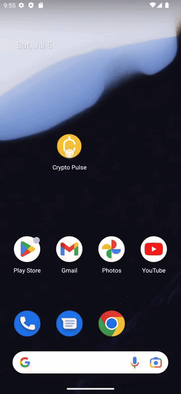
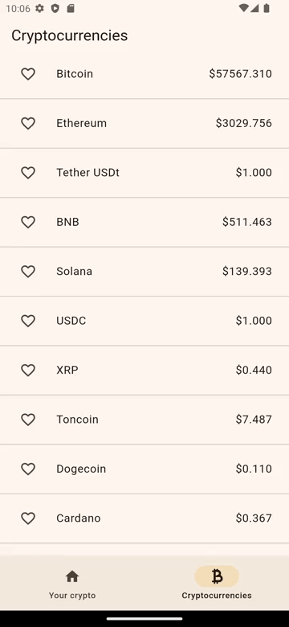
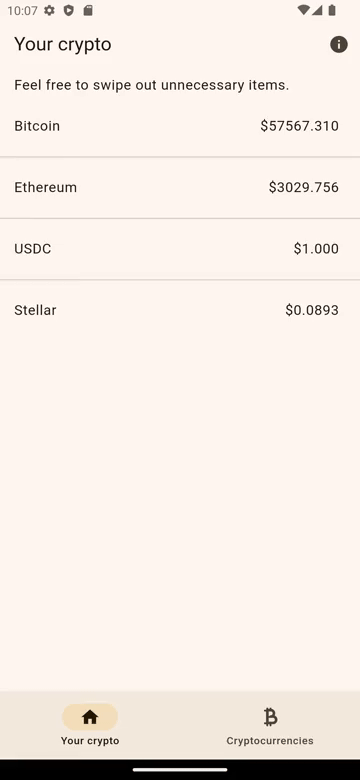

# Crypto Pulse

## _Check your favorite cryptocurrencies_

 

## Table of Contents

- [Description](#description)
- [System Requirements](#system-requirements)
- [Installation](#installation)
- [Instructions](#instructions)
- [Testing](#testing)
- [Dependencies](#dependencies)
- [Contributors](#contributors)

## Description
A tiny, light-weight application aimed at checking current cryptocurrencies' prices according to the CoinMarketCap API. Also, it's obvious that it'd be cool to monitor your favorite ones, wouldn't it? So the appropriate opportunity is provided as well. Nothing else but crypto.

## System Requirements

Your device has to meet the following requirements:
- Android OS with API Level $\geq$ 21 (version 5.0 or higher);
- 1 GB of RAM;
- ~50 MB of free space.

## Installation

For now, you can get the app by checking the repository's _[/out](./out/)_ dir.

## Instructions

Once you have a need to check cryptocurrencies' prices, just launch the app. If you want to add some crypto in the _All Cryptocurrencies_ page as a favorite, it's as easy as hitting the 'Heart' icon :heart: next to the crypto's name. Then you can check your favorites in the _Your crypto_ page:

If you want to remove some cryptocurrencies from your favorites, feel free to just toss them off by right swiping:

## Testing

Almost every class has been covered with tests (Unit & Widget). The coverage percentage was roughly 70% at the time.

## Dependencies

The following noticeable libraries & frameworks are in use in the app:
- [Flutter](https://flutter.dev/) (no comments);
- [Provider](https://github.com/rrousselGit/provider) (state management);
- [RxDart](https://github.com/ReactiveX/rxdart) (ReactiveX implementation for Dart);
- [DotEnv](https://github.com/java-james/flutter_dotenv) (working with environment variables via .env file);
- [SqfLite](https://github.com/tekartik/sqflite) (SQLite plugin for Flutter);
- [Get It](https://github.com/fluttercommunity/get_it) (service locator, used for DI);
- [Injectable](https://github.com/Milad-Akarie/injectable) (code generator for Get It);
- [Go Router](https://github.com/flutter/packages/tree/main/packages/go_router) (a declarative router based on Navigation);
- [Flutter Native Splash](https://github.com/jonbhanson/flutter_native_splash) (automatic Splash screen generation for Android & iOS);
- [Mockito](https://github.com/dart-lang/mockito) (mocking classes for tests);

## Contributors

The application was fully made by Semyon Dzukaev in 2024. All rights reserved.
